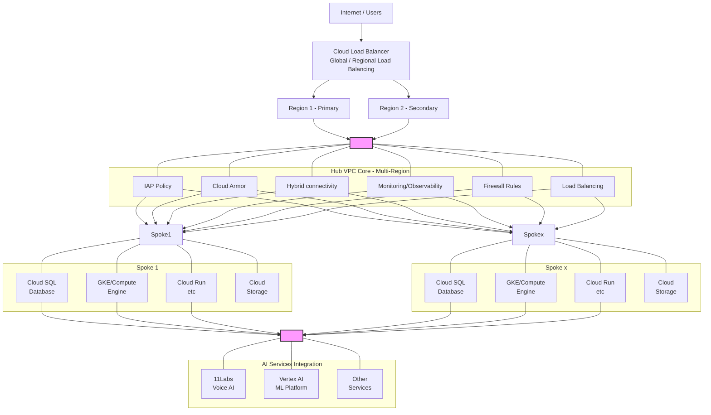

# Architecture Overview

## Executive Summary and Strategic Alignment
The rapid evolution of generative AI agents necessitates a robust, scalable, and secure infrastructure capable of supporting autonomous workflows. This design details the architectural blueprint for deploying a CrewAI enterprise automation platform on Google Kubernetes Engine (GKE), strictly adhering to the [Konecta Enterprise Architecture Blueprint](https://docs.google.com/document/d/1BHrjf6wcxGR32UsjwrO2GGFEmo7eB8bGCjchllTLThI). The proposed solution addresses the requirements for a multi-environment deployment (Development, Staging, Production) and provides a specific, secure mechanism for direct internet access secured using Cloud Armor and IAM integration, operating as a governed exception to the standard connectivity model.

The Konecta Cloud Adoption Program outlines a transformative initiative to modernize IT operations, emphasizing operational efficiency, security, resilience, and innovation. The deployment of CrewAI,  framework for orchestrating role-playing AI agents-directly supports the goal of leveraging Google Cloud's capabilities in data analytics and AI to support business goals. However, the dynamic and often unpredictable nature of autonomous agents introduces specific challenges regarding network egress, identity management, and state persistence that must be reconciled with Konecta's rigid governance standards.

This architecture is founded on the Standard Global Landing Zone principles defined by Konecta. It leverages a Hub-and-Spoke network topology to ensure isolation, ** TBC! Keycloak for centralized identity federation **, and a Zero-Trust security model enforced via Google Cloud’s Identity-Aware Proxy (IAP). By mapping the CrewAI components to Konecta’s standardized naming conventions, resource hierarchy, and infrastructure-as-code (IaC) mandates, this report provides a comprehensive blueprint for implementation

The following analysis proceeds through the layers of the architecture: Governance, Networking, Compute, Security, and Operations. Each section dissects the specific Konecta principles involved, identifies the technical implementation details for CrewAI, and provides deep strategic insights into the implications of these design choices.

## Architecture Diagram

## Core Components

### 1. 🌐 Global Ingress and Edge Security
These components handle traffic entry, global routing, and initial security enforcement at the network edge.

* Cloud Load Balancer (Global HTTP(S) LB): Provides Anycast IP, Global Edge Termination, SSL/TLS termination, and Default Proximity Routing to the nearest healthy region.
* Cloud Armor: Provides DDoS & WAF Protection with Edge Enforcement and Adaptive Protection.
* Firewall Rules (Ingress): Controls allowed incoming traffic at the edge and hub boundaries.

### 2. 🛡️ Hub VPC Core (Central Networking & Control)
This multi-region hub acts as the control plane for networking, security, and shared services.

* Virtual Private Cloud (VPC): The foundational Multi-region VPC network enabling global connectivity and Private Google Access.
* Identity-Aware Proxy (IAP) Policy: Enforces Zero Trust Enforcement and IAM Authorization for access control.
* Firewall Rules (Egress): Controls allowed outbound connections from the network to external services.
* Hybrid connectivity: Manages connections to on-premises or external infrastructure.
* Load Balancing (Internal): Regional load balancers for internal service traffic within the Hub or between Spokes.

### 3. 🖥️ Regional Compute Layer (Spokes)
These are the regional application environments where the core workload resides, deployed across a primary and secondary region.

* Regional Deployment: Utilizes Region 1 (Primary) and Region 2 (Secondary) for high availability and disaster recovery.
* Google Kubernetes Engine (GKE): Managed Kubernetes clusters for containerized application deployment.
* Compute Engine: IaaS utilizing Managed Instance Groups (for auto-scaling) and Shielded VMs (for security).
* Cloud Run: Serverless container platform offering Auto-scaling from zero and a Pay-per-use model.

### 4. 🗄️ Data and Storage Layer (Spokes)
Components dedicated to managing persistent and highly available data storage for the applications.

* Cloud SQL: Managed relational database service (PostgreSQL/MySQL) with High Availability and automated recovery.
* Cloud Storage: Multi-regional buckets for highly available object storage, supporting Lifecycle policies and Versioning.

### 5. 🤖 AI Services Integration
Specific components for integrating specialized external and internal AI/ML capabilities.

* Vertex AI (ML Platform): Manages end-to-end machine learning lifecycle, including Model training and serving.
* 11Labs Integration (Voice AI): Secure API gateway for integrating external AI services.
* Other Services: Placeholder for future specialized integrations.

### 6. 🔒 Operations and Governance (Cross-Cutting)
Central services providing monitoring, logging, and security governance across the entire architecture.

* VPC Service Controls: Establishes Perimeter security for APIs to prevent data exfiltration.
* Identity and Access Management (IAM): Manages Service accounts and enforces Custom roles.
* Cloud KMS*: Manages encryption keys, covering Encryption key management and Key rotation policies.
* Cloud Monitoring: Provides visibility via Custom dashboards and Alerting policies for SLOs.
* Cloud Logging: Offers Centralized log aggregation and log-based metrics.
* Cloud Trace: Provides Distributed tracing for performance and latency analysis.

## Data Flow

This flow integrates the specific security, networking, and application components of your *multi-region, hub-and-spoke architecture*.

---

### 1. 🌐 External Request Flow (Ingress to Application)

This traces the request from the public internet through the security and networking layers to the backend compute services. 

1.  *User Request* $\rightarrow$ *Global Edge / Cloud Load Balancer (Global HTTP(S) LB):
    * The request targets the Load Balancer's *Anycast IP*.
    * *Cloud Armor* enforces *DDoS & WAF Protection* at the edge of the network.

2.  *Edge / Load Balancer* $\rightarrow$ *Hub VPC Core / IAP Policy:
    * The Load Balancer performs *Default Proximity Routing*, directing traffic to the closest healthy region (*Region 1* or *Region 2*).
    * *IAP Policy* (if enabled) enforces *Zero Trust* authentication and authorization before the request proceeds.

3.  *Hub VPC Core* $\rightarrow$ *Spoke VPC (Application Layer):
    * *Firewall Rules* are checked for network separation and access control between the Hub and Spoke.
    * The request is routed across the *Multi-region VPC network* to the target application in the Spoke (e.g., GKE, Cloud Run, or Compute Engine).

4.  *Application (Compute Layer) $\rightarrow$ Internal Services:
    * The application (on *Cloud Run, GKE, or Compute Engine*) processes the request and calls supporting services:
        * *Database: Accesses *Cloud SQL* for transactional data.
        * *Storage: Retrieves or stores objects in *Cloud Storage* buckets.
        * *AI Services: Initiates the internal *AI Agent Workflow* (see next section).

5.  *Application $\rightarrow$ User Response:
    * The final response travels back through the Spoke, Hub, Load Balancer, and returns to the end-user.

---

### 2. 🤖 AI Agent Workflow (Internal Processing)

This section describes the internal, often asynchronous, process for tasks delegated to AI services.

1.  *Trigger* $\rightarrow$ *Orchestration (CrewAI / Application):
    * The application initiates the workflow, and the orchestrator (*CrewAI*) coordinates the overall task.

2.  *Orchestration $\rightarrow$ Agent Tasks (Processing):
    * Individual agents perform specialized tasks, leveraging secure outbound connections:
        * *AI Processing: Calls *Vertex AI* for internal ML model execution.
        * *Voice Synthesis: Calls *11Labs Integration (Voice AI)* via a secure API gateway (Egress traffic controlled by Hub Firewall Rules).
        * *Data Retrieval: Agents query necessary data from *Cloud SQL, Firestore, or Cloud Storage*.

3.  *State Management $\rightarrow$ Data Storage:
    * *Cloud SQL* are used to persist the state, history, or context of the agent workflow.

4.  *Final Results $\rightarrow$ Caller Application:
    * The results are returned to the calling application, completing the processing cycle.
    * All steps are monitored by *Cloud Monitoring* and logged by *Cloud Logging*.

---

Do you need a diagram of the *Hub and Spoke VPC model* to better visualize the network separation?

## High Availability Design

### Multi-Region Deployment

- *Primary Region*: Active production traffic
- *Secondary Region*: Failover and read replicas
- *Tertiary Region*: Disaster recovery

### Failover Strategy

- Automatic failover via load balancer health checks
- Database replication across regions
- State synchronization for stateless services
- DNS failover for complete region outages

### Disaster Recovery

- Automated backups with point-in-time recovery
- Cross-region backup replication
- Documented recovery procedures
- Regular disaster recovery testing

## Scalability Design

### Horizontal Scaling

- Auto-scaling instance groups
- Cloud Run automatic scaling
- GKE horizontal pod autoscaling
- Load balancer distribution

### Vertical Scaling

- Machine type upgrades
- Database instance size increases
- Storage capacity expansion

### Cost Optimization

- Preemptible instances for non-critical workloads
- Committed use discounts
- Right-sizing recommendations
- Automated resource scheduling

## Security Architecture

See [Security Architecture](/architecture/security-architecture) for detailed security design.

## Next Steps

- [Design Principles](/architecture/design-principles) - Core design principles
- [Component Diagram](/architecture/component-diagram) - Detailed component documentation
- [Blueprints](/architecture/blueprints) - Reference architectures
- [Networking](/architecture/networking) - Network architecture details

---

*Related Documentation*:
- [Terraform Overview](/terraform/overview)
- [Security Overview](/security/overview)
- [Developer Guide](/developer-guide/deployment)

