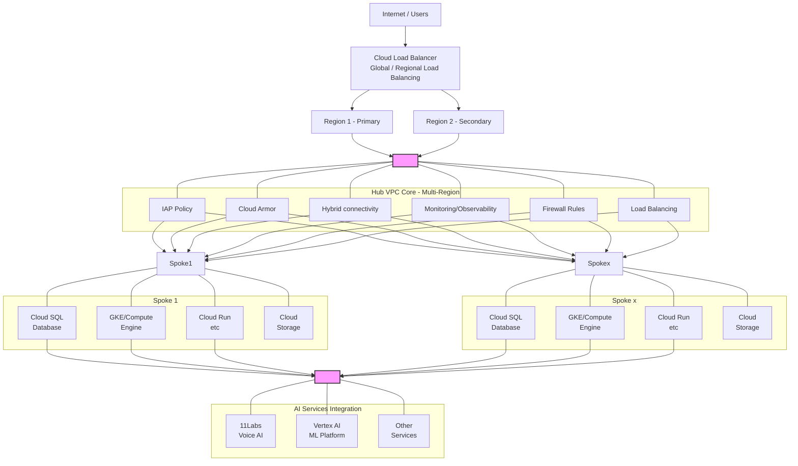

# Architecture Overview

<Tip>
Before diving into the architecture details, ensure you've reviewed the [Prerequisites](/developer-guide/prerequisites) and understand the foundational concepts of Google Cloud Platform and Kubernetes.
</Tip>

## Executive Summary and Strategic Alignment

The rapid evolution of generative AI agents necessitates a robust, scalable, and secure infrastructure capable of supporting autonomous workflows. This design details the architectural blueprint for deploying a CrewAI enterprise automation platform on Google Kubernetes Engine (GKE), strictly adhering to the [Konecta Enterprise Architecture Blueprint](https://docs.google.com/document/d/1BHrjf6wcxGR32UsjwrO2GGFEmo7eB8bGCjchllTLThI).

<Warning>
**Governed Exception to Standard Connectivity Model**

The proposed solution provides a specific, secure mechanism for direct internet access secured using Cloud Armor and IAM integration, operating as a **governed exception** to the standard connectivity model. This requires explicit approval and ongoing compliance monitoring.
</Warning>

The Konecta Cloud Adoption Program outlines a transformative initiative to modernize IT operations, emphasizing operational efficiency, security, resilience, and innovation. The deployment of CrewAI, a framework for orchestrating role-playing AI agents, directly supports the goal of leveraging Google Cloud's capabilities in data analytics and AI to support business goals. However, the dynamic and often unpredictable nature of autonomous agents introduces specific challenges regarding network egress, identity management, and state persistence that must be reconciled with Konecta's rigid governance standards.

<Info>
**Pending Architecture Decision**

**Keycloak for centralized identity federation** - This component is still under review and will be finalized in the next architecture iteration.
</Info>

This architecture is founded on the Standard Global Landing Zone principles defined by Konecta. It leverages a Hub-and-Spoke network topology to ensure isolation, and a Zero-Trust security model enforced via Google Cloud's Identity-Aware Proxy (IAP). By mapping the CrewAI components to Konecta's standardized naming conventions, resource hierarchy, and infrastructure-as-code (IaC) mandates, this report provides a comprehensive blueprint for implementation.

The following analysis proceeds through the layers of the architecture: Governance, Networking, Compute, Security, and Operations. Each section dissects the specific Konecta principles involved, identifies the technical implementation details for CrewAI, and provides deep strategic insights into the implications of these design choices.

## Architecture Diagram

<Note>
**Interactive Diagram Guide**

The diagram below illustrates the multi-region hub-and-spoke architecture with:
- **Pink circles** (⚪): Connection hubs joining multiple components
- **Flow direction**: Traffic flows from top (Internet/Users) down through regions to services
- **Reading order**: Follow the numbered sections from 1 (Internet) → 6 (Operations)

The architecture supports high availability across multiple regions with centralized security controls.
</Note>

```mermaid
graph TD
    %% Section 1: Internet to Load Balancer
    A[Internet / Users] --> B[Cloud Load Balancer<br>Global / Regional Load Balancing];

    %% Section 2: Load Balancer to Regions
    B --> C[Region 1 - Primary];
    B --> D[Region 2 - Secondary];

    %% Section 3: Regions to Hub VPC Core
    subgraph Hub VPC Core - Multi-Region
        direction LR
        IAP[IAP Policy]
        CA[Cloud Armor]
        HC[Hybrid connectivity]
        MO[Monitoring/Observability]
        FR[Firewall Rules]
        LB_Hub[Load Balancing]
    end
    
    C --> H_Join;
    D --> H_Join;
    
    H_Join(( )) --- IAP;
    H_Join --- CA;
    H_Join --- HC;
    H_Join --- MO;
    H_Join --- FR;
    H_Join --- LB_Hub;

    style H_Join fill:#f9f,stroke:#333,stroke-width:2px,shape:circle
    
    %% Section 4: Hub to Spokes
    IAP --> Spoke1;
    CA --> Spoke1;
    HC --> Spoke1;
    MO --> Spoke1;
    FR --> Spoke1;
    LB_Hub --> Spoke1;
    IAP --> Spokex;
    CA --> Spokex;
    HC --> Spokex;
    MO --> Spokex;
    FR --> Spokex;
    LB_Hub --> Spokex;

    
    %% Section 5: Spoke details
    subgraph Spoke 1
        direction LR
        S1_CS[Cloud SQL<br> Database]
        S1_GKE[GKE/Compute<br>Engine]
        S1_CR[Cloud Run<br>etc]
        S1_Sto[Cloud<br>Storage]
    end
    
    subgraph Spoke x
        direction LR
        Sx_CS[Cloud SQL<br> Database ]
        Sx_GKE[GKE/Compute<br>Engine]
        Sx_CR[Cloud Run<br>etc]
        Sx_Sto[Cloud<br>Storage]
    end
    
    %% Connections within Spokes (for layout purposes)
    Spoke1 --- S1_CS & S1_GKE & S1_CR & S1_Sto;
    Spokex --- Sx_CS & Sx_GKE & Sx_CR & Sx_Sto;


    %% Section 6: Spoke Connections to AI Services
    S1_CS --> AIS_Join;
    S1_GKE --> AIS_Join;
    S1_CR --> AIS_Join;
    Sx_CS --> AIS_Join;
    Sx_GKE --> AIS_Join;
    Sx_CR --> AIS_Join;
    
    subgraph AI Services Integration
        direction LR
        AIS_11[11Labs<br> Voice AI]
        AIS_VX[Vertex AI<br> ML Platform]
        AIS_Other[Other<br>Services]
    end
    
    AIS_Join(( )) --- AIS_11;
    AIS_Join --- AIS_VX;
    AIS_Join --- AIS_Other;
    
    style AIS_Join fill:#f9f,stroke:#333,stroke-width:2px,shape:circle
    
    
    %% Define the invisible hub nodes and set styles
    H_Join[ ]
    AIS_Join[ ]
```

## Core Components

<Tabs>
  <Tab title="🌐 Edge Security">
    ### Global Ingress and Edge Security

    These components handle traffic entry, global routing, and initial security enforcement at the network edge.

    **Cloud Load Balancer (Global HTTP(S) LB)**
    - Anycast IP addressing
    - Global Edge Termination
    - SSL/TLS termination
    - Default Proximity Routing to the nearest healthy region

    **Cloud Armor**
    - DDoS & WAF Protection
    - Edge Enforcement
    - Adaptive Protection

    **Firewall Rules (Ingress)**
    - Controls allowed incoming traffic at the edge and hub boundaries
  </Tab>

  <Tab title="🛡️ Hub VPC Core">
    ### Central Networking & Control

    This multi-region hub acts as the control plane for networking, security, and shared services.

    **Virtual Private Cloud (VPC)**
    - Multi-region VPC network
    - Global connectivity
    - Private Google Access

    **Identity-Aware Proxy (IAP) Policy**
    - Zero Trust Enforcement
    - IAM Authorization for access control

    **Firewall Rules (Egress)**
    - Controls allowed outbound connections to external services

    **Hybrid Connectivity**
    - Manages connections to on-premises or external infrastructure

    **Load Balancing (Internal)**
    - Regional load balancers for internal service traffic
    - Hub-to-Spoke and Spoke-to-Spoke routing
  </Tab>

  <Tab title="🖥️ Compute Layer">
    ### Regional Compute Layer (Spokes)

    Regional application environments where the core workload resides, deployed across primary and secondary regions.

    **Regional Deployment**
    - Region 1 (Primary)
    - Region 2 (Secondary)
    - High availability and disaster recovery

    **Google Kubernetes Engine (GKE)**
    - Managed Kubernetes clusters
    - Containerized application deployment
    - Auto-scaling and self-healing

    **Compute Engine**
    - IaaS platform
    - Managed Instance Groups (auto-scaling)
    - Shielded VMs (security hardening)

    **Cloud Run**
    - Serverless container platform
    - Auto-scaling from zero
    - Pay-per-use model
  </Tab>

  <Tab title="🗄️ Data & Storage">
    ### Data and Storage Layer (Spokes)

    Components dedicated to managing persistent and highly available data storage for the applications.

    **Cloud SQL**
    - Managed relational database service
    - PostgreSQL/MySQL support
    - High Availability configuration
    - Automated backups and recovery

    **Cloud Storage**
    - Multi-regional buckets
    - Highly available object storage
    - Lifecycle policies
    - Object versioning
  </Tab>

  <Tab title="🤖 AI Services">
    ### AI Services Integration

    Specific components for integrating specialized external and internal AI/ML capabilities.

    **Vertex AI (ML Platform)**
    - End-to-end machine learning lifecycle
    - Model training and serving
    - AutoML capabilities
    - MLOps integration

    **11Labs Integration (Voice AI)**
    - Secure API gateway
    - External AI service integration
    - Voice synthesis capabilities

    **Other Services**
    - Placeholder for future specialized integrations
    - Extensible architecture for new AI providers
  </Tab>

  <Tab title="🔒 Operations">
    ### Operations and Governance (Cross-Cutting)

    Central services providing monitoring, logging, and security governance across the entire architecture.

    **VPC Service Controls**
    - Perimeter security for APIs
    - Data exfiltration prevention

    **Identity and Access Management (IAM)**
    - Service account management
    - Custom role enforcement
    - Least privilege principle

    **Cloud KMS**
    - Encryption key management
    - Key rotation policies
    - Hardware security module (HSM) support

    **Cloud Monitoring**
    - Custom dashboards
    - Alerting policies for SLOs
    - Real-time metrics

    **Cloud Logging**
    - Centralized log aggregation
    - Log-based metrics
    - Audit trail retention

    **Cloud Trace**
    - Distributed tracing
    - Performance analysis
    - Latency debugging
  </Tab>
</Tabs>

<Check>
**Core Components Overview Complete**

You now understand the six main architectural layers: Edge Security, Hub VPC Core, Compute Layer, Data & Storage, AI Services, and Operations & Governance.
</Check>

## Data Flow

This flow integrates the specific security, networking, and application components of the multi-region, hub-and-spoke architecture.

### 1. 🌐 External Request Flow (Ingress to Application)

This traces the request from the public internet through the security and networking layers to the backend compute services.

<Steps>
  <Step title="User Request to Global Edge">
    **User Request → Global Edge / Cloud Load Balancer (Global HTTP(S) LB)**

    - The request targets the Load Balancer's **Anycast IP**
    - **Cloud Armor** enforces **DDoS & WAF Protection** at the edge of the network
    - Initial security validation occurs before routing
  </Step>

  <Step title="Load Balancer to Hub VPC">
    **Edge / Load Balancer → Hub VPC Core / IAP Policy**

    - The Load Balancer performs **Default Proximity Routing**, directing traffic to the closest healthy region (**Region 1** or **Region 2**)
    - **IAP Policy** (if enabled) enforces **Zero Trust** authentication and authorization before the request proceeds
    - User identity is verified against IAM policies
  </Step>

  <Step title="Hub to Spoke Routing">
    **Hub VPC Core → Spoke VPC (Application Layer)**

    - **Firewall Rules** are checked for network separation and access control between the Hub and Spoke
    - The request is routed across the **Multi-region VPC network** to the target application in the Spoke
    - Target may be GKE, Cloud Run, or Compute Engine
  </Step>

  <Step title="Application Processing">
    **Application (Compute Layer) → Internal Services**

    The application processes the request and calls supporting services:
    - **Database**: Accesses **Cloud SQL** for transactional data
    - **Storage**: Retrieves or stores objects in **Cloud Storage** buckets
    - **AI Services**: Initiates the internal **AI Agent Workflow** (see next section)
  </Step>

  <Step title="Response to User">
    **Application → User Response**

    - The final response travels back through the Spoke, Hub, Load Balancer
    - Response is delivered to the end-user
    - All traffic is monitored and logged
  </Step>
</Steps>

<Check>
**External Request Flow Complete**

User requests flow through: Load Balancer → Cloud Armor → IAP → Hub VPC → Spoke VPC → Application → Response
</Check>

### 2. 🤖 AI Agent Workflow (Internal Processing)

This section describes the internal, often asynchronous, process for tasks delegated to AI services.

<Steps>
  <Step title="Workflow Initiation">
    **Trigger → Orchestration (CrewAI / Application)**

    - The application initiates the workflow
    - The orchestrator (**CrewAI**) coordinates the overall task
    - Task parameters and context are defined
  </Step>

  <Step title="Agent Task Execution">
    **Orchestration → Agent Tasks (Processing)**

    Individual agents perform specialized tasks, leveraging secure outbound connections:

    - **AI Processing**: Calls **Vertex AI** for internal ML model execution
    - **Voice Synthesis**: Calls **11Labs Integration (Voice AI)** via a secure API gateway (Egress traffic controlled by Hub Firewall Rules)
    - **Data Retrieval**: Agents query necessary data from **Cloud SQL**, Firestore, or **Cloud Storage**
  </Step>

  <Step title="State Persistence">
    **State Management → Data Storage**

    - **Cloud SQL** is used to persist the state, history, or context of the agent workflow
    - Ensures workflow continuity and recovery
    - Maintains audit trail for compliance
  </Step>

  <Step title="Results Return">
    **Final Results → Caller Application**

    - The results are returned to the calling application, completing the processing cycle
    - All steps are monitored by **Cloud Monitoring**
    - All activities are logged by **Cloud Logging**
  </Step>
</Steps>

<Check>
**AI Agent Workflow Complete**

AI workflows follow: Trigger → Orchestration → Agent Tasks → State Persistence → Results Return
</Check>

<Info>
For a detailed visualization of the Hub and Spoke VPC model showing network separation and traffic isolation, see the [Networking Architecture](/architecture/networking) documentation.
</Info>

## High Availability Design

<AccordionGroup>
  <Accordion title="Multi-Region Deployment" icon="globe">
    **Regional Distribution Strategy**

    - **Primary Region**: Active production traffic
      - Handles all live user requests
      - Optimized for low latency
      - Full read/write capabilities

    - **Secondary Region**: Failover and read replicas
      - Standby mode for disaster recovery
      - Read replicas for database queries
      - Reduced resource allocation vs. primary

    - **Tertiary Region**: Disaster recovery
      - Cold standby configuration
      - Backup storage and archives
      - Activated only during major incidents

    <Tip>
    Deploy primary and secondary regions in close geographic proximity (e.g., us-central1 and us-east1) to minimize replication latency while maintaining regional separation for disaster scenarios.
    </Tip>
  </Accordion>

  <Accordion title="Failover Strategy" icon="arrows-rotate">
    **Automated Failover Mechanisms**

    - **Automatic failover via load balancer health checks**
      - HTTP/HTTPS health probes every 5-10 seconds
      - Unhealthy backend removal within 30 seconds
      - Traffic automatically redirected to healthy region

    - **Database replication across regions**
      - Cloud SQL regional replication (synchronous or asynchronous)
      - Read replicas for load distribution
      - Automatic promotion of replicas during primary failure

    - **State synchronization for stateless services**
      - Session data stored in centralized cache (Memorystore)
      - Stateless application design for horizontal scaling
      - Configuration synchronized via Secret Manager

    - **DNS failover for complete region outages**
      - Cloud DNS with low TTL values (60 seconds)
      - Health-based routing policies
      - Automatic DNS record updates during outage

    <Warning>
    Test failover procedures quarterly to ensure RTO (Recovery Time Objective) and RPO (Recovery Point Objective) targets are met. Document all failover scenarios and runbooks.
    </Warning>
  </Accordion>

  <Accordion title="Disaster Recovery" icon="life-ring">
    **Backup and Recovery Procedures**

    - **Automated backups with point-in-time recovery**
      - Cloud SQL automated daily backups
      - Transaction log retention for PITR
      - 7-day backup retention (configurable up to 365 days)

    - **Cross-region backup replication**
      - Backups replicated to geographically distant region
      - Multi-regional Cloud Storage buckets
      - Versioning enabled for all critical data

    - **Documented recovery procedures**
      - Step-by-step recovery runbooks
      - Role-based access for disaster recovery team
      - Communication protocols for incident response

    - **Regular disaster recovery testing**
      - Quarterly DR drills
      - Full region failover testing annually
      - Post-test reports with improvement recommendations

    <Note>
    **Recovery Objectives:**
    - RTO (Recovery Time Objective): < 1 hour for critical services
    - RPO (Recovery Point Objective): < 5 minutes for database
    - SLA Target: 99.95% uptime (multi-region deployment)
    </Note>
  </Accordion>
</AccordionGroup>

## Scalability Design

<Tabs>
  <Tab title="Horizontal Scaling">
    ### Scale Out Strategy

    **Auto-scaling instance groups**
    - Managed Instance Groups (MIGs) with autoscaling policies
    - CPU utilization threshold: 70%
    - Scale up: Add instances when load increases
    - Scale down: Remove instances during low traffic
    - Minimum instances: 2 (for HA)
    - Maximum instances: 10 (configurable)

    **Cloud Run automatic scaling**
    - Serverless auto-scaling from 0 to N instances
    - Request-based scaling (target: 80 concurrent requests per instance)
    - Cold start optimization with minimum instances
    - Scales to zero when idle for cost efficiency

    **GKE horizontal pod autoscaling**
    - Horizontal Pod Autoscaler (HPA) based on CPU/memory
    - Custom metrics autoscaling (e.g., queue depth, request rate)
    - Cluster autoscaler for node pool expansion
    - Pod disruption budgets for safe scaling

    **Load balancer distribution**
    - Traffic distributed across healthy backends
    - Session affinity (optional) for stateful applications
    - Connection draining during scale-down (60-second grace period)

    <Tip>
    Horizontal scaling is preferred for stateless workloads as it provides better fault tolerance and cost efficiency compared to vertical scaling.
    </Tip>
  </Tab>

  <Tab title="Vertical Scaling">
    ### Scale Up Strategy

    **Machine type upgrades**
    - E2 series: General-purpose workloads (e2-small → e2-standard-4)
    - N2 series: Compute-intensive workloads (n2-standard-2 → n2-standard-8)
    - C2 series: Ultra high-performance computing
    - Requires instance restart (planned maintenance window)

    **Database instance size increases**
    - Cloud SQL machine type upgrades
    - Storage auto-increase enabled
    - Read replicas for read-heavy workloads
    - Minimal downtime during upgrades (< 2 minutes)

    **Storage capacity expansion**
    - Cloud Storage: Unlimited capacity (no manual intervention)
    - Persistent Disk: Expand without detaching (online resize)
    - Cloud SQL storage: Auto-increase from 10GB to 10TB

    <Note>
    Vertical scaling provides immediate performance improvements but has upper limits. Plan for eventual horizontal scaling as the primary growth strategy.
    </Note>
  </Tab>

  <Tab title="Cost Optimization">
    ### Cost Efficiency Strategies

    **Preemptible instances for non-critical workloads**
    - 80% cost savings vs. standard instances
    - Suitable for batch processing, CI/CD, data processing
    - Maximum runtime: 24 hours
    - Graceful shutdown handling required

    **Committed use discounts**
    - 1-year commitment: 37% discount
    - 3-year commitment: 55% discount
    - Applied automatically to matching resources
    - Recommended for predictable baseline workloads

    **Right-sizing recommendations**
    - Google Cloud Recommender analysis
    - Idle resource identification
    - Over-provisioned instance detection
    - Monthly cost savings reports

    **Automated resource scheduling**
    - Dev/Test environment shutdown during off-hours
    - Cloud Scheduler + Cloud Functions automation
    - Weekend shutdown for non-production environments
    - Potential savings: 60-70% for dev/test environments

    <Tip>
    Combine multiple cost optimization strategies: Use committed use discounts for baseline production capacity, preemptible instances for batch jobs, and automated scheduling for development environments.
    </Tip>
  </Tab>
</Tabs>

<Check>
**Scalability Design Complete**

Choose the appropriate scaling strategy based on workload characteristics: Horizontal for stateless apps, Vertical for databases, and Cost Optimization for all environments.
</Check>

## Security Architecture

The security architecture implements a defense-in-depth strategy with multiple layers of protection. For comprehensive security details, see [Security Architecture](/architecture/security-architecture).

<CardGroup cols={3}>
  <Card title="Identity & Access" icon="shield-halved" href="/architecture/security-architecture#iam">
    IAM policies, service accounts, and Zero Trust implementation
  </Card>
  <Card title="Network Security" icon="network-wired" href="/architecture/security-architecture#network">
    VPC Service Controls, firewall rules, and Cloud Armor
  </Card>
  <Card title="Data Protection" icon="lock" href="/architecture/security-architecture#data">
    Encryption at rest and in transit, Cloud KMS, and DLP
  </Card>
</CardGroup>

<Info>
**Security Compliance**: This architecture adheres to Konecta's security standards and supports compliance with SOC 2, ISO 27001, and GDPR requirements.
</Info>

## Next Steps

<CardGroup cols={2}>
  <Card title="Design Principles" icon="compass" href="/architecture/design-principles">
    Core design principles guiding architectural decisions
  </Card>
  <Card title="Component Diagram" icon="diagram-project" href="/architecture/component-diagram">
    Detailed component documentation and interactions
  </Card>
  <Card title="Blueprints" icon="drafting-compass" href="/architecture/blueprints">
    Reference architectures and deployment patterns
  </Card>
  <Card title="Networking" icon="network-wired" href="/architecture/networking">
    Network architecture details and Hub-Spoke topology
  </Card>
</CardGroup>

## Related Documentation

<CardGroup cols={3}>
  <Card title="Terraform Overview" icon="code" href="/terraform/overview">
    Infrastructure as Code implementation
  </Card>
  <Card title="Security Overview" icon="shield" href="/security/overview">
    Security policies and best practices
  </Card>
  <Card title="Developer Guide" icon="terminal" href="/developer-guide/deployment">
    Deployment procedures and developer workflows
  </Card>
</CardGroup>

